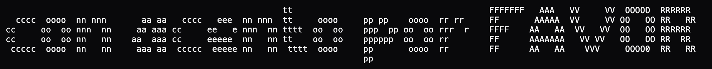

# 

## ᴀʙᴏᴜᴛ

## ᴡʜʏ

## ᴡʜᴏ

## ᴄᴏɴᴛʀɪʙᴜᴛɪɴɢ ᴛᴏ ᴛʜɪꜱ ᴘʀᴏᴊᴇᴄᴛ

## ᴛʜɪꜱ ᴘʀᴏᴊᴇᴄᴛ ᴄᴏᴜʟᴅ ɴᴏᴛ ʜᴀᴠᴇ ʙᴇᴇɴ ᴅᴇᴠᴇʟᴏᴘᴇᴅ ᴡɪᴛʜᴏᴜᴛ ᴜꜱᴇ ᴏꜰ ᴛʜᴇ ꜰᴏʟʟᴏᴡɪɴɢ ʀᴇꜱᴏᴜʀᴄᴇꜱ ᴀɴᴅ ʀᴇꜰᴇʀᴇɴᴇᴄᴇꜱ:

👤 | Element | 🔗 |
|:--------------:|:----------------:|:----------------------------------------------------------:|
@w3schools | `key press events`  | https://www.w3schools.com/jsref/event_onkeypress.asp 
@CodeLab | `key press events`  | https://www.youtube.com/watch?v=8__gPh2F8xM 
@Injosoft | `ASCII generator` | https://www.asciiart.eu/image-to-ascii
@OptimisticWeb | `placeholder text` | https://www.youtube.com/watch?v=8__gPh2F8xM  
@talha | `typing game` |  https://he-is-talha.github.io/html-css-javascript-games/30-Typing-Game/
@HenrikJoreteg | `key frame animation`  |  https://blog.andyet.com/2015/07/17/generating-css-keyframe-animations-with-javascript/
@Taghmagazine | `bitmap font` | https://www.youtube.com/shorts/TULorU5MTYo?feature=share 
@FontGen | `font generator` |https://fontgen.cool/

## ʟɪᴄᴇɴꜱᴇ
